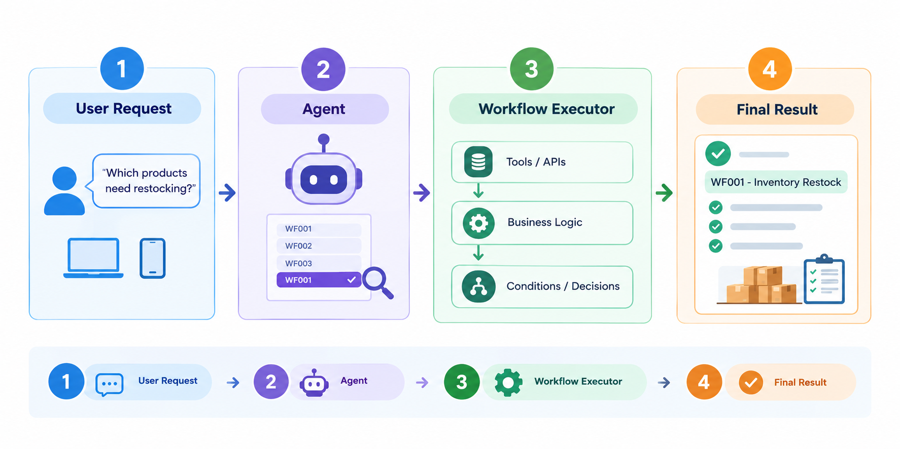

# Workflow Assignment Chatbot

LIVE DEMO: [https://workflowassignment.onrender.com/]

This project is a highly scalable, dynamic workflow-based chatbot application built with Streamlit and LangGraph. It allows users to interact with various automated workflows seamlessly through a conversational interface.

## Features

- **Dynamic Registry System:** Workflows are automatically discovered and added to the chatbot without needing to modify the core application logic.
- **LLM Routing:** An intelligent router automatically reads the registry and routes user queries to the appropriate workflow.
- **Plug-and-Play Architecture:** Easily scale to hundreds of workflows without merge conflicts.

## Architecture

The architecture has four main parts.

1. First, the user's request goes to the agent.
2. The agent identifies the matching workflow from the workflow definitions.
3. Then the workflow executor runs the required tools and business logic.
4. Finally, the result is returned to the user along with the workflow and execution steps.



## Installation

1. **Clone the repository:**

   ```bash
   git clone https://github.com/VaibhavPo/WorkflowAssignment
   cd WorkflowAssignment
   ```

2. **Set up environment variables:**
   Copy the provided `.env.example` to `.env` and fill in your API keys.

   ```bash
   cp .env.example .env
   ```

   **Getting your Groq API Key:**
   - Go to the [Groq Console (API Keys)](https://console.groq.com/keys).
   - Create a new API key.
   - Open the newly created `.env` file and paste your key: `GROQ_API_KEY=your_api_key_here`

3. **Install dependencies:**
   Make sure you have Python installed, then install the required packages (Streamlit, LangGraph, etc.):
   ```bash
   pip install -r requirements.txt
   ```
   > **Note:** The requirements are kept unpinned to avoid version conflicts across different environments. However, if you encounter legacy or compatibility errors, this project was built and successfully tested with: `Python 3.13.7`,`langgraph==1.2.14`, `streamlit==1.65.0`, `pandas==3.0.6`, `pydantic==2.10.4`, and `langchain-groq==1.1.3`.

## Usage

To run the application, start the Streamlit server:

```bash
python -m streamlit run app.py
```

This will launch the web interface where you can interact with the chatbot and trigger the available workflows.

## How to Add a New Workflow

We built a highly scalable, dynamic registry system to minimize friction. You don't need to do anything in the chatbot code itself (like `app.py`).

### The Path of Least Resistance

To make creating a new workflow as low-friction as possible, follow this plug-and-play template. For example, if you want to create a new workflow `WF003`, simply create a new folder `workflow/wf003_your_workflow_name/` and include these standard files:

- **`__init__.py`**: This is the most important file. You define a `WorkflowMetadata` object here (with its description and trigger prompt) and call `registry.register()`. This exposes it to the chatbot.
- **`state.py`**: Define your workflow's state by extending `BaseWorkflowState`.
- **`graph.py`**: Define your LangGraph node edges (`StateGraph`).
- **`nodes.py`**: Write the actual Python functions that execute your logic. **Note:** You should heavily reuse functions from the `tools/` folder (like `read_data` or `calculate`) here to save time.
- **`models.py`** _(Optional)_: Any Pydantic models you need for structured data validation.

### The `tools/` Directory

When building new workflows, avoid rewriting standard logic. The `tools/` folder contains pre-built, reusable utilities designed to be shared across all workflows:

- **Data Handling:** Scripts like `read_data.py` heavily utilize `pandas`, `numpy`, and `openpyxl` to seamlessly read and process CSV and Excel files.
- **API Communication:** Scripts like `llm_generate.py` utilize the `requests` library to fetch and interact with endpoints.

By importing from `tools/`, you keep your workflow's `nodes.py` clean, lightweight, and maintainable.

### How Auto-Discovery Works

Inside `workflow/__init__.py`, there is a `discover_workflows()` function. When your Streamlit chatbot starts, it runs this function, which automatically scans the `workflow/` directory for any subfolders starting with `wf` (like `wf001_...`, `wf002_...`).

It automatically imports them, and their metadata (name, description, trigger) is added to the global registry. The chatbot's LLM router automatically reads this registry. This means the moment you create a new workflow, the chatbot instantly knows about it and can route user queries to it!

By keeping workflows completely isolated in their own folders and relying on the auto-discovery registry, you can scale this up to hundreds of workflows without ever creating merge conflicts or breaking the core chatbot application.

## Test Prompts and Data Mapping

> 👉 **[Click here to view the latest automated test execution results](test_results.md)**

| #   | Workflow | Test prompt                                                                                                                                                                                                                                                                                                                                                                                                                     | Associated File(s)                            | Main thing being tested                       |
| --- | -------- | ------------------------------------------------------------------------------------------------------------------------------------------------------------------------------------------------------------------------------------------------------------------------------------------------------------------------------------------------------------------------------------------------------------------------------- | --------------------------------------------- | --------------------------------------------- |
| 1   | WF001    | "Check the inventory and tell me which products need restocking. Also calculate how many units should be reordered for each one."                                                                                                                                                                                                                                                                                               | `data/sample_inventory.csv`                   | threshold + reorder calculation               |
| 2   | WF002    | "Validate our product prices against the vendor price list and show only products where the vendor price differs from ours by more than 10%."                                                                                                                                                                                                                                                                                   | `data/vendor_prices.csv`, `data/products.csv` | SKU matching + percentage decision            |
| 3   | WF003    | "Process this vendor Excel file. Clean the column names, identify rows missing either SKU or product name, and give me the cleaned data and invalid-row report."                                                                                                                                                                                                                                                                | `data/vendor_products.csv`                    | file ingestion + validation                   |
| 4   | WF004    | "Generate product content for the following product:<br>Product name: UrbanTrail Backpack<br>Category: Travel & Outdoor Bags<br>Attributes: 25L capacity, laptop compartment, water-resistant, multiple pockets<br>Material: Polyester<br>Color: Black<br>Target audience: College students and young professionals<br>Generate: A detailed product description, A short product description, An SEO title, A meta description" | None                                          | LLM generation + no hallucination             |
| 5   | WF005    | "Check the status of order ORD-1001 and tell me its shipment and tracking information."                                                                                                                                                                                                                                                                                                                                         | `data/orders.db`                              | missing-order/error handling                  |
| 6   | WF006    | "Scan the product catalog for duplicates. Separate definite duplicates from possible duplicates and include your confidence for each possible match."                                                                                                                                                                                                                                                                           | `data/products.csv`                           | exact matching + similarity/confidence        |
| 7   | WF007    | "Create a campaign brief for our new product collection. The target audience is young professionals and the promotion is 20% off."                                                                                                                                                                                                                                                                                              | None                                          | missing required inputs                       |
| 8   | WF008    | "Classify these keywords by search intent, remove duplicates, map them to the appropriate product/category pages, and identify the highest-priority keywords."                                                                                                                                                                                                                                                                  | `data/keywords_inclusive.csv`                 | classification + mapping + prioritization     |
| 9   | WF009    | "Assign this urgent development task to the best employee based on their skills and current workload. If nobody has both the required skills and enough capacity, escalate instead of assigning someone unsuitable."                                                                                                                                                                                                            | `data/tasks.csv`, `data/employee_data.csv`    | ranking + capacity + escalation               |
| 10  | WF010    | "Analyze the workflow execution logs and tell me which workflows are performing poorly. Include failure rate, average execution time, frequent errors, slow steps, and recommendations."                                                                                                                                                                                                                                        | `data/workflow_logs.csv`                      | aggregation + threshold detection + reporting |
