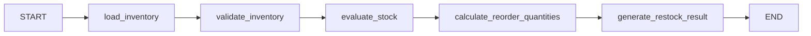

# Inventory Restock Workflow (WF001)

## Overview
The **WF001** workflow is a deterministic, end‑to‑end pipeline that processes raw inventory data, identifies items that are below their required stock levels, calculates how much each low‑stock item should be reordered, and produces a final restock report.  
It is built with **LangGraph** and follows a linear sequence of nodes, each responsible for a single, well‑defined transformation of the workflow state.

Key capabilities:

| Feature | Description |
|---------|-------------|
| **Data ingestion** | Reads inventory records from a configurable source (e.g., CSV, JSON, database). |
| **Validation** | Converts raw rows into strongly‑typed `InventoryItem` objects, collecting any validation errors. |
| **Stock evaluation** | Determines which items are under‑stocked using a global or per‑item minimum‑stock threshold. |
| **Reorder calculation** | Computes the quantity to reorder for each low‑stock item via a generic `calculate` tool. |
| **Result generation** | Emits a structured JSON‑compatible result containing the restock list and any errors encountered. |

The workflow is completely deterministic—no LLM prompts are used—making it suitable for production batch jobs or API‑driven inventory management services.

---

## Data Flow



1. **START → `load_inventory`**  
   *Reads raw records from `state.inventory_source` and stores them in `state.inventory_records`.*

2. **`load_inventory` → `validate_inventory`**  
   *Transforms each raw record into an `InventoryItem` (Pydantic model). Valid items are saved to `state.valid_inventory_items`; validation errors are accumulated in `state.errors`.*

3. **`validate_inventory` → `evaluate_stock`**  
   *Compares each item's `current_stock` against its `minimum_stock` (or a global `minimum_stock_threshold`). Items that fall below the threshold are collected in `state.low_stock_items`.*

4. **`evaluate_stock` → `calculate_reorder_quantities`**  
   *For every low‑stock item, the `calculate` tool computes the required reorder quantity. Results are stored as `RestockItem` objects in `state.restock_items`.*

5. **`calculate_reorder_quantities` → `generate_restock_result`**  
   *Aggregates the final restock list, attaches any accumulated errors, and writes the final payload to `state.final_result`.*

6. **`generate_restock_result` → END**  
   *Workflow terminates, returning the compiled state (including `final_result` and an execution trace).*

Throughout the pipeline, the state also tracks an `execution_steps` list that logs a human‑readable trace of each node’s outcome.

---

## Nodes Used

| Node | Function | Input (state fields) | Output (state fields) | Remarks |
|------|----------|----------------------|-----------------------|---------|
| **`load_inventory`** | Reads raw inventory data from the configured source. | `inventory_source`, `execution_steps`, `errors` | `inventory_records`, updated `execution_steps`, `errors` | Uses `tools.read_data.read_data`. |
| **`validate_inventory`** | Parses and validates raw records into `InventoryItem` models. | `inventory_records`, `execution_steps`, `errors` | `valid_inventory_items`, updated `execution_steps`, `errors` | Invalid rows are logged but do not stop the flow. |
| **`evaluate_stock`** | Determines which items are below their minimum stock level. | `valid_inventory_items`, `minimum_stock_threshold`, `execution_steps` | `low_stock_items`, updated `execution_steps` | Leverages `tools.calculate.calculate` with the `"threshold_comparison"` operation. |
| **`calculate_reorder_quantities`** | Computes reorder quantities for low‑stock items. | `low_stock_items`, `minimum_stock_threshold`, `execution_steps` | `restock_items`, updated `execution_steps` | Calls `tools.calculate.calculate` with the `"reorder_quantity"` operation; falls back to `0.0` on failure. |
| **`generate_restock_result`** | Packages the final output and error summary. | `restock_items`, `errors`, `execution_steps` | `final_result`, updated `execution_steps` | Result format: `{status, restock_list, errors}`. |

All nodes receive and return the same `WF001State` object, enabling seamless state mutation across the graph.

---

## Code Structure

```
wf001/
├── graph.py          # Builds and compiles the LangGraph StateGraph
├── state.py          # Definition of WF001State (inherits BaseWorkflowState)
├── models.py         # Pydantic models: InventoryItem & RestockItem
├── nodes.py          # Implementations of the five workflow nodes
├── prompts.py        # Empty – deterministic pipeline, no LLM prompts
└── tools/
    ├── read_data.py  # read_data(source) → {"records": [...]}
    └── calculate.py  # calculate(operation, **kwargs) → {"status": "...", "result": ...}
```

### `graph.py`
* Imports `StateGraph`, `START`, `END` from LangGraph.
* Registers each node (`load_inventory`, `validate_inventory`, …) with a human‑readable name.
* Connects the nodes in the linear order described in **Data Flow**.
* Returns a compiled graph ready to be executed (`workflow.compile()`).

### `state.py`
* Extends `BaseWorkflowState` (provided by the project’s workflow core).
* Declares all fields that flow through the pipeline:
  * `inventory_source` – path/identifier for the raw data.
  * `minimum_stock_threshold` – optional global fallback threshold.
  * `inventory_records` – raw list of dictionaries from the source.
  * `valid_inventory_items` – list of `InventoryItem` objects.
  * `low_stock_items` – subset of items needing replenishment.
  * `restock_items` – list of `RestockItem` objects with calculated quantities.
* The base class also supplies generic dict‑like access (`state["key"]`) used by the nodes.

### `models.py`
* **`InventoryItem`** – validated representation of a single inventory row.
* **`RestockItem`** – enriched representation that includes the computed `reorder_quantity`.

Both models inherit from `pydantic.BaseModel`, providing automatic type coercion and `.model_dump()` for JSON‑serializable output.

### `nodes.py`
* Contains the five pure‑function node implementations.
* Each node:
  1. Retrieves needed values from the state.
  2. Performs its specific logic (reading, validation, calculation, etc.).
  3. Updates the state with new fields and appends a human‑readable entry to `execution_steps`.
  4. Returns the mutated state.

The file also imports the shared `WF001State` type for static typing and the `tools` utilities for I/O and calculation.

### `prompts.py`
* Intentionally empty because WF001 does **not** involve any LLM‑driven steps. The comment clarifies this design decision.

### `tools/`
* **`read_data.py`** – Abstracts data source handling (CSV, JSON, DB, etc.). Returns a dict with a `records` key.
* **`calculate.py`** – Generic calculation engine used for:
  * Threshold comparison (`"threshold_comparison"`).
  * Reorder quantity computation (`"reorder_quantity"`).  
  Returns a dict with `status`, `result`, and optional `message`.

---

## Getting Started

```bash
# Install dependencies (LangGraph, Pydantic, etc.)
pip install -r requirements.txt

# Example usage
python - <<'PY'
from wf001.graph import create_inventory_restock_graph

# Prepare initial state
initial_state = {
    "inventory_source": "data/inventory.csv",
    "minimum_stock_threshold": 10.0,
    "execution_steps": [],
    "errors": []
}

graph = create_inventory_restock_graph()
final_state = graph.invoke(initial_state)

print(final_state["final_result"])
PY
```

The script above demonstrates how to instantiate the compiled graph, feed it an initial state, and retrieve the structured restock report.

---

## Extending the Workflow

* **Add alternative data sources** – Extend `tools.read_data.read_data` to support APIs or cloud storage.
* **Custom calculation logic** – Implement new operations in `tools.calculate.calculate` and invoke them from a new node.
* **Branching / conditional paths** – Replace the linear graph with conditional edges (`workflow.add_conditional_edge`) to handle special cases (e.g., emergency restock).

Because each node is a pure function that receives and returns the same state object, new functionality can be inserted without touching existing nodes, preserving testability and maintainability.